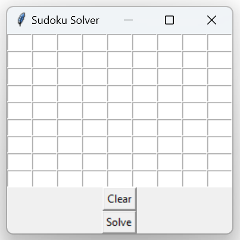
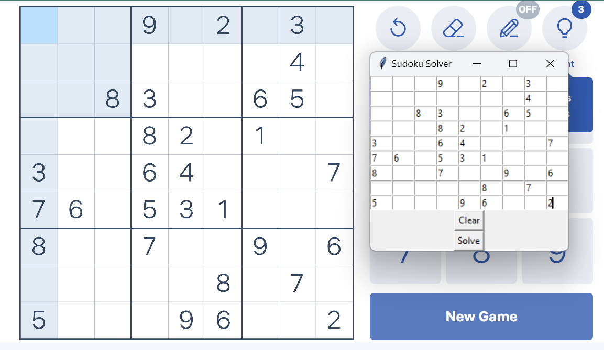
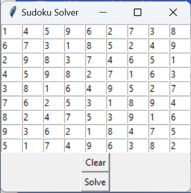

# PRODIGY_SD_04
# Sudoku Solver Program

## Hello Users!!!

Welcome to the Sudoku Solver program. This program is created using Python programming language. It allows users to input an unsolved Sudoku puzzle, and upon clicking the solve button, it displays the solved puzzle. Below are the images demonstrating the deployed code.

### Table of Contents
- [Initial Page](#initial-page)
- [Entering Unsolved Sudoku](#entering-unsolved-sudoku)
- [Solved Sudoku](#solved-sudoku)

### Initial Page

This is the initial page displayed when the program runs.

### Entering Unsolved Sudoku

This image shows a sample unsolved Sudoku puzzle taken from a website and entered into the grids.

### Solved Sudoku

This image shows the solved Sudoku puzzle after clicking the solve button.
